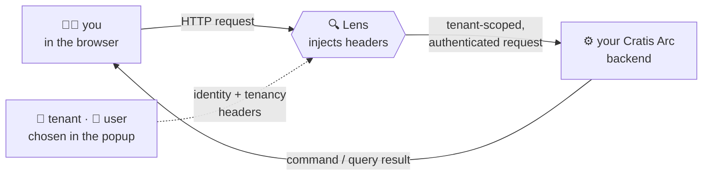

<div align="center">

# 🔍 Lens

**The developer's viewfinder for the Cratis Stack — become any user, step into any tenant, and fire commands and queries at your running app, straight from the browser.**

[](https://discord.gg/kt4AMpV8WV)
[](https://github.com/Cratis/Lens/actions/workflows/pull-requests.yml)
[](https://github.com/Cratis/Lens/actions/workflows/publish.yml)
[](LICENSE)

</div>

---

On a film set, the **lens** is what the camera sees the scene through — swap it and the whole shot changes: a
new angle, a tighter focus, a different depth of field. That's the idea. Lens is the lens you point at your
running Cratis Arc application while you build it: watch it as a **different user**, from inside a **different
tenant**, and focus right in on a single command or query to see exactly what the backend does — no rebuild,
no hand-crafted headers, no leaving the page you're already on.

The friction it removes is real: no more pasting identity headers into a REST client, no more restarting the
app to switch tenants, no more writing throwaway test harnesses just to see what a query returns.

## 🔍 Why "Lens"?

Three reasons, and they all line up:

- **The camera lens sets the point of view.** A cinematographer chooses the lens to decide what the audience
  sees and how it's framed. Lens does the same for your app in development: choose the user, choose the tenant,
  and every request is framed from that point of view.
- **A lens is also what you inspect through.** Beyond the camera, a lens magnifies and focuses — it's an
  instrument for *seeing clearly*. Lens brings your commands and queries under the glass so you can test them
  and read back exactly what they return.
- **The Cratis storytelling family.** Cratis names its products after telling a story: **Chronicle** records
  what happened, **Arc** shapes the plot, **Screenplay** is the script, **Stage** performs it, **Studio**
  storyboards it, **Narrator** reads it back… **Lens** is the camera you watch the rehearsal through. It joins
  the cast.

## 🎥 What a session looks like

Lens lives in your browser toolbar. Open the popup and you're directing the shot:

- **🏢 Pick a tenant** — the tenancy header is injected into every request; test multi-tenant behavior without
  touching config or restarting.
- **👤 Pick a user** — identity, claims, and permissions ride along, so the backend authorizes the request as
  that person.
- **🧪 Browse the cast** — Lens introspects the app's `/.cratis/commands` and `/.cratis/queries` endpoints and
  lists every command and query, grouped by namespace; fill in parameters, fire it, and read the response
  inline.
- **🔧 Check the frame** — the current tenant, user, and identity context are always visible at a glance.

Nothing about your frontend changes — Lens injects at the network boundary, transparently, only while the
extension is active.

## 🧠 How it works — header injection at the boundary

When the extension is active, Lens rewrites the requests your web app makes, adding the headers your backend
already expects. Your code is none the wiser:



- **Identity headers** — when you select a user, Lens injects the context, claims, and permissions your backend
  reads for authorization, following the
  [Cratis Arc authentication specification](https://www.cratis.io/arc/backend/core/authentication/#microsoft-identity-platform-azure).
- **Tenancy headers** — when you select a tenant, Lens injects the tenant identifier that routes the request to
  the right partition, following the
  [Cratis Arc tenancy resolvers specification](https://www.cratis.io/arc/backend/tenancy/resolvers/).
- **Automatic propagation** — the headers ride along on command execution, query requests, and any HTTP call
  your app makes, so the backend always receives a properly authenticated, tenant-scoped request.
- **A clean cut on every switch** — headers alone don't change who you are once the backend has issued a
  session. Changing the active user or tenant clears the Arc `.cratis-identity` cookie on the configured
  origins and reloads the matching tabs, so the next request is authenticated as the person you just picked.

## ✨ Features at a glance

| Feature | Purpose |
| --- | --- |
| **🏢 Tenant Selector** | Switch tenants instantly; the tenancy header is auto-injected |
| **👤 User Selector** | Simulate different users; identity, claims, and permissions follow |
| **🔌 Arc Development Sources** | Point Lens at a local or remote Cratis Arc backend |
| **🧪 Command Explorer** | Browse and execute backend commands with real parameters |
| **🧪 Query Explorer** | Run queries and inspect the payloads that come back |
| **🔧 Context View** | See the current tenant, user, and identity context |

## 🚀 Quick start

Build the extension and load it into Chrome:

```bash
cd Source
yarn install
yarn build                 # bundles the unpacked extension into Source/dist/
```

Then, in Chrome:

1. Open `chrome://extensions/`
2. Enable **Developer mode**
3. Click **Load unpacked** and select the `Source/dist` folder

Now open your Cratis Arc app in the browser, open the Lens popup once so it detects the Arc context, then use
**Settings** to add your **Arc Development Sources** (local or remote endpoints) and set up the users and
tenants for your scenarios. The full walkthrough — including watch-mode development and release publishing — is
in [`Documentation/GettingStarted`](Documentation/GettingStarted/index.md).

For active development with hot reload:

```bash
cd Source
yarn dev                   # Vite rebuilds on change; reload the extension after each build
yarn test                  # run the specs
yarn ci                    # typecheck, specs and build — the same gate CI runs
```

## 🗺️ What's in this repo

```plaintext
Source/
├── manifest.json           # extension manifest (MV3)
├── main.tsx / LensPopup.tsx # popup UI entry point
├── background/             # service worker that injects headers
├── commands/               # command explorer
├── queries/                # query explorer
├── settings/              # configuration, tenant/user management
├── context/               # identity and tenancy context
├── shared/                # shared utilities and types
└── arc/                   # Cratis Arc integration
```

## ✅ Quality gates

```bash
cd Source
yarn typecheck   # zero TypeScript errors
yarn build       # the extension builds clean
yarn test        # all specs green
```

## 🔗 Links

- [Cratis Arc documentation](https://www.cratis.io/arc/)
- [Authentication & identity](https://www.cratis.io/arc/backend/core/authentication/#microsoft-identity-platform-azure)
- [Tenancy & resolvers](https://www.cratis.io/arc/backend/tenancy/resolvers/)
- [Cratis Chronicle](https://www.cratis.io/chronicle/)
- [Privacy policy](PRIVACY_POLICY.md) — what Lens does and doesn't collect

---

<div align="center">

*Part of the [Cratis](https://cratis.io) platform · Licensed under the [MIT license](LICENSE)*

</div>
